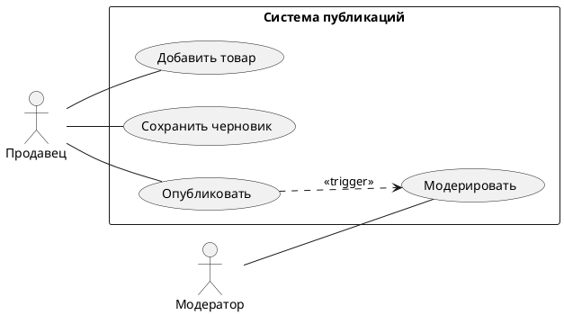

# Use Case: Публикация товара

**ID:** UC-01
**Название:** Публикация нового товара
**Актер:** Продавец
**Предусловия:** Продавец авторизован в Личном кабинете.

## Диаграмма Use Case (PlantUML)

## Основной поток (Main Success Scenario):
1. Продавец переходит в раздел "Мои товары" и нажимает кнопку "Добавить товар".
2. Система отображает форму создания товара.
3. Продавец вводит обязательные данные:
    - Название товара
    - Описание
    - Категория (выбор из дерева категорий)
    - Цена (в рублях)
    - Количество на складе
4. Продавец загружает минимум одно изображение товара.
5. Продавец нажимает кнопку "Опубликовать".
6. Система проверяет корректность заполнения всех полей (валидация).
7. Система сохраняет данные товара со статусом "На модерации".
8. Система выводит сообщение об успешной отправке на модерацию.
9. Система создает задачу для внутреннего модератора.

## Альтернативные потоки:

### А1: Ошибка валидации
6а. Система обнаруживает незаполненные обязательные поля или некорректный формат данных (например, отрицательная цена).
6б. Система подсвечивает ошибочные поля красным и выводит подсказки по исправлению.
6в. Продавец вносит исправления и возвращается к шагу 5.

### А2: Сохранение в черновик
5а. Продавец нажимает кнопку "Сохранить как черновик".
5б. Система сохраняет данные без обязательной валидации всех полей со статусом "Черновик".
5в. Использование завершается.

### А3: Отклонение модератором
10. Модератор отклоняет товар по причине нарушения правил (например, запрещенный контент).
11. Система меняет статус товара на "Отклонен".
12. Система отправляет уведомление Продавцу с указанием причины отклонения.
13. Продавец может отредактировать товар и повторно отправить на модерацию (возврат к шагу 2).

## Пост-условия:
- Товар сохранен в базе данных.
- В случае успешной модерации товар появляется на витрине маркетплейса (статус "Опубликован").
